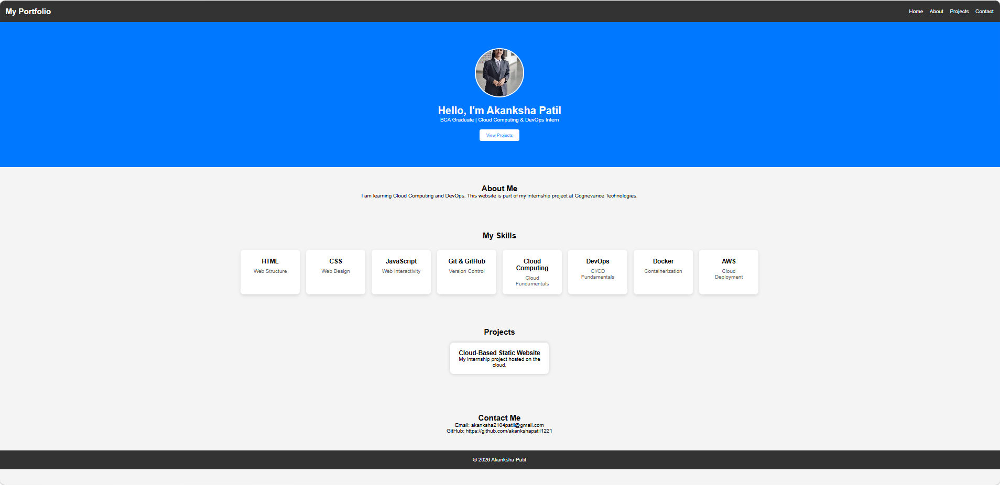
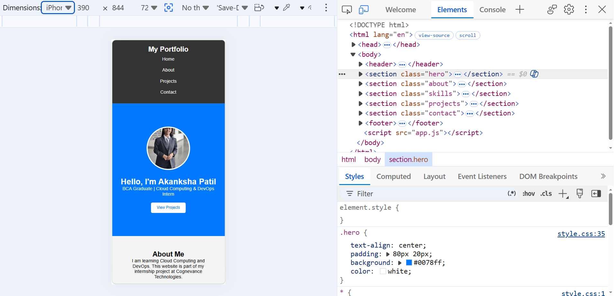
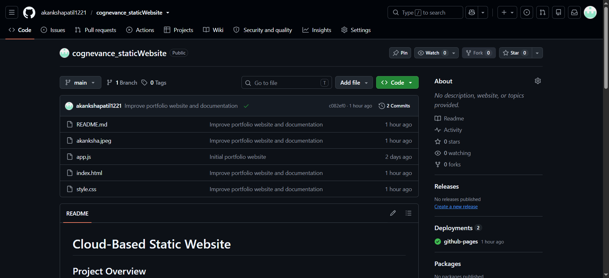
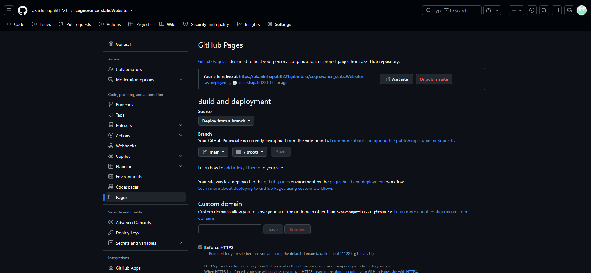
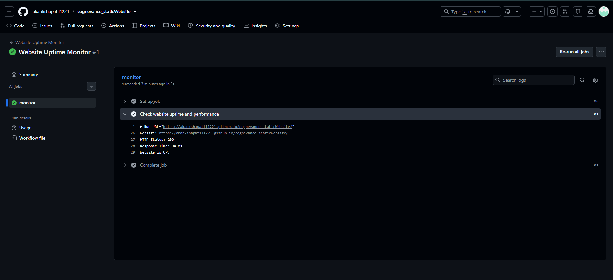

# Cloud-Based Static Website

## Project Overview

This project is a responsive static portfolio website developed as part of my
Cloud Computing & DevOps internship at Cognevance Technologies.

The website demonstrates basic web development, version control and cloud
deployment using GitHub Pages.

## Technologies Used

- HTML5
- CSS3
- JavaScript
- Git
- GitHub
- GitHub Pages

## Features

- Responsive portfolio website
- About Me section
- Skills section
- Projects section
- Contact section
- GitHub Pages deployment

## How to Run Locally

1. Clone the repository.

2. Open the project folder.

3. Open `index.html` in a web browser.

## Deployment

The website is deployed using GitHub Pages.

Live Website:

https://akankshapatil1221.github.io/cognevance_staticWebsite/

## Repository

GitHub Repository:

https://github.com/akankshapatil1221/cognevance_staticWebsite

## Project Structure

Project-1-Static-Website/

│
├── .github/
│   └── workflows/
│       └── website-monitor.yml
│
├── screenshots/
│   ├── website-desktop.png
│   ├── website-mobile.png
│   ├── github-repository.png
│   ├── github-pages.png
│   └── uptime-monitoring.png
│
├── akanksha.jpeg
├── app.js
├── index.html
├── README.md
└── style.css

## Screenshots

### Desktop View

### Mobile View

### GitHub Repository

### GitHub Pages Deployment

### Uptime Monitoring

## Internship

This project is completed as part of the Cloud Computing & DevOps internship
at Cognevance Technologies.